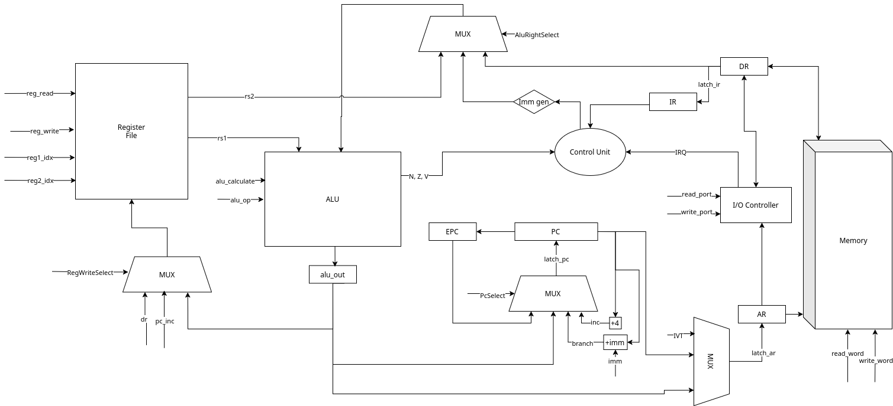
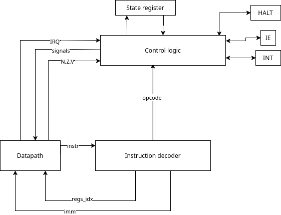

# Отчёт по лабораторной работе №4
ФИО: Косов Артём Андреевич

Группа: P3230

Вариант: `alg | risc | neum | hw | tick | binary | trap | port | pstr | prob2 | vector`

# Язык программирования

Форма Бэкуса-Наура:
```ebnf
<program> ::= <external-declaration>*


<external-declaration> ::= <interrupt-marker> <type-specifier> <identifier> <function-suffix>
                         | <type-specifier> <identifier> ( <function-suffix> | <declaration-suffix> )

<function-suffix>    ::= "(" <parameter-list>? ")" <compound-statement>
<declaration-suffix> ::= ( "[" <integer-constant> "]"
                         | "=" <expression>
                         | "[]" "=" <string>
                         ) ";"


<type-specifier> ::= "int" | "void" | <identifier>

<parameter-list> ::= <parameter-declaration> { "," <parameter-declaration> }*

<parameter-declaration> ::= <type-specifier> <identifier> ("[" "]")?


<declaration>  ::= <type-specifier> <identifier> <declaration-suffix>


<compound-statement> ::= "{" { <declaration> | <statement> }* "}"

<statement> ::= <assignment-statement>
              | <expression-statement>
              | <compound-statement>
              | <if-statement>
              | <while-statement>
              | <return-statement>

<assignment-statement> ::= <identifier> "=" <expression> ";"
                         | <identifier> "[" <expression> "]" "=" <expression> ";"

<expression-statement> ::= <expression>? ";"

<if-statement> ::= "if" "(" <expression> ")" <statement> [ "else" <statement> ]

<while-statement> ::= "while" "(" <expression> ")" <statement>

<return-statement> ::= "return" <expression>? ";"

<expression> ::= <logical-or-expression>

<logical-or-expression> ::= <logical-and-expression> { "||" <logical-and-expression> }*
<logical-and-expression> ::= <equality-expression> { "&&" <equality-expression> }*
<equality-expression> ::= <relational-expression> { ("==" | "!=") <relational-expression> }*
<relational-expression> ::= <shift-expression> { ("<" | ">" | "<=" | ">=") <shift-expression> }*
<shift-expression> ::= <additive-expression> { ("<<" | ">>") <additive-expression> }*
<additive-expression> ::= <multiplicative-expression> { ("+" | "-") <multiplicative-expression> }*
<multiplicative-expression> ::= <bitwise-expression> { ("*" | "/" | "%") <bitwise-expression> }*
<bitwise-expression> ::= <unary-expression> { ("|" | "^" | "&") <unary-expression> }*


<unary-expression> ::= ( "-" | "!" | "~" ) <unary-expression> | <primary-expression>


<primary-expression> ::= <identifier>
                       | <identifier> "[" <expression> "]"
                       | <identifier> "(" <argument-expression-list>? ")"
                       | <integer-constant>
                       | <char-constant>
                       | <string>
                       | "(" <expression> ")"

<argument-expression-list> ::= <expression> { "," <expression> }*

<interrupt-marker> ::= "__interrupt__" "(" <integer-constant> ")"

```

Пример программы на языке программирования:
```c
void print_string(int str[]){
      int size = str[0];
      int i = 1;
      while (i <= size) {
          out(str[i], 0);
          i = i + 1;
      }
  }

  int string[] = "hello world";

  int main() {
      print_string(string);
      return 0;
  }
```


## Семантика языка программирования
Язык программирования представляет собой подмножество языка программирования Си и поддерживает его основные возможности: поддержка глобальных и локальных переменных, объявление и вызов функций, ветвления с помощью условных операторов `if` и `else`, циклический оператор `while`. Имеется поддержка команд ввода/вывода `in` и `out`,  семантически являющиеся выражением вызова функции, но транслирующиеся напрямую в соответсвтующие инструкции процессора.  
Также присутствует модификатор функции `__interrupt__`, позволяющий объявить функцию как обработчик соответствующего прерывания прерывания и добавить адрес функции в таблицу прерываний.
Пример использования модификатора `__interrupt__`:

```c
int num = 0;
__interrupt__(0)
void read_number(){
    num = in(0);
}

```

## Стратегия вычислений
Язык программирования имплементирует стратегию вызова по значению (call by value) при передаче аргументов для вызова функции. Значения аргументов вычисляются непосредственно перед вызовом в аппликативном порядке.

## Области видимости

В языке существуют глобальная и локальная область видимости. Локальная область видимости ограничена любым вложенным блоком `{}` (условные операторы, циклы, функции).
Переменные, объявленные в локальной области, называются локальными и доступны в этом же или нижестоящем по вложенности блоке. Члены глобальной области видимости объявляются вне функций и доступны везде, но могут перекрываться локальными объявлениями.

## Типизация
Язык использует статическую строгую типизацию и позволяет работать с одним числовым типом `int`, а также статическими массивами `int[]`. Также имеется строенный тип `void`, но он не является полноценным типом и используется лишь как маркер отсутствия возвращаемого значения функции. 
В языке существуют следующие виды литералов:
- численные (знаковое целое число от -2147483648 до 2147483647)
- символьные (одиночный ASCII-символ с возможностью использования спец. символов вроде '\n' или '\t' )
- строковые (набор символьных элементов, заключенных в кавычки, подчиняющихся правилам символьных отдельных литералов)

Строки не имеют отдельного типа данных и рассматриваются как объявления типа `int[]`

Пример объявления переменных и использования литералов:
```c
int num = 123;
int arr[5];
int chr = 'A';
int string[] = "Hello, world!";
```

## Организация памяти
Используется архитектура фон Неймана с единым адресным пространством для данных и инструкций
Машинное слово - 32 бита

**Варианты адресации**:
- Смещение относительно регистра (rs2 + imm)
- Смещение относительно pc (pc + imm)
- Непосредственная
- Абсолютная 

```
+-----------------------------+
│ 0x00: JAL _start            |
│ 0x04: HALT                  │
│ 0x08 ... 0x0F: reserved     │
│ 0x10: interruption vector 0 │ 
│ 0x14: interruption vector 1 │
│ ...                         │
│ 0x80: _start                │
│       ...                   │
│       function 1            │
|       function 2            |
│       ...                   │
│    n: data section          |
|       num literals          |
|       string literals       |
|       global variables      |
|       ...                   │
|    i: stack data            |
|       ...                   |
+-----------------------------+
```

Программисту доступны глобальная память для хранения литералов и части глобальных переменных, а также автоматическая память для хранения локальных переменных и данных, связанных с вызовами функций.

Таблица векторов прерываний фиксирована по адресу 0x10. Каждая запись - 4 байта, содержит абсолютный адрес обработчика. При прерывании CU вычисляет адрес 0x10 + irq_vector * 4, читает из памяти адрес обработчика и передаёт туда управление, предварительно сохранив PC в регистр EPC и сбросив флаг IE.

**Доступные регистры:** 

| Регистр | Назначение                        |
| ------- | --------------------------------- |
| zero    | Константы 0                       |
| ra      | Адрес возврата из функции         |
| sp      | Указатель стека                   |
| fp      | Указатель фрейма стека            |
| a0-a7   | Аргументы и возвращаемые значения |
| t0-t2   | Временные регистры                |
| s5-s11  | Глобальные переменные             |


Отдельные численные, символьные литералы и символы в составе строковых литералов хранятся в одном машинном слове (32 бита) соответственно и размещаются в статической data-секции программы или загружаются с помощью инструкции при возможности, при этом первое машинное слово строки выделено под длину строки (Pascal string).

Литерал будет использован при помощи непосредственной адресации для литералов в числовом диапазоне [-32768; 32767] 

Константы  как механизм не предусмотрены, но могут быть реализованы с помощью глобальных переменных, инициализированных литералами.

Литералы размещаются в статической памяти друг за другом в порядке, определенным их появлением в исходном коде программы.

Литерал, требующие для хранения несколько машинных слов размещаются в последовательных машинных словах.

Первые 7 глобальных переменных, объявленных в программе, размещаются в регистрах s5-s11, остальные - в статической памяти. Локальные переменные размещаются в автоматической памяти (стеке).


## Система команд

### Типы команд и способы кодирования:

### 1. R-Type (Арифметико-логические операции)
```text
+────────+───────+───────+───────+─────────────+
| 31..26 | 25.21 | 20.16 | 15.11 | 10........0 |
+────────+───────+───────+───────+─────────────+
| opcode |  rd   |  rs1  |  rs2  |  reserved   |
+────────+───────+───────+───────+─────────────+
```
### 2. I-Type (Операции с константой / Загрузка из памяти)
```
+────────+───────+───────+─────────────────────+
| 31..26 | 25.21 | 20.16 | 15................0 |
+────────+───────+───────+─────────────────────+
| opcode |  rd   |  rs1  |         imm         |
+────────+───────+───────+─────────────────────+
```
### 3. B-Type (Условные переходы)

```
+────────+───────+───────+─────────────────────+
| 31..26 | 25.21 | 20.16 | 15................0 |
+────────+───────+───────+─────────────────────+
| opcode |  rs1  |  rs2  |         imm         |
+────────+───────+───────+─────────────────────+
```

### 4. S-Type (Запись в память / Вывод в порт)
```
+────────+───────+───────+─────────────────────+
| 31..26 | 25.21 | 20.16 | 15................0 |
+────────+───────+───────+─────────────────────+
| opcode |  rs2  |  rs1  |         imm         |
+────────+───────+───────+─────────────────────+
```
### 5. J-Type (Безусловный переход и сохранение адреса возврата)
```
+────────+───────+─────────────────────────────+
| 31..26 | 25.21 | 20........................0 |
+────────+───────+─────────────────────────────+
| opcode |  rd   |             imm             |
+────────+───────+─────────────────────────────+
```
### 6. U-Type (lui)
```
+────────+───────+───+─────────────────────────+
| 31..26 | 25.21 |20 | 19....................0 |
+────────+───────+───+─────────────────────────+
| opcode |  rd   | 0 |           imm           |
+────────+───────+───+─────────────────────────+
```
*20 бит - reserved
### 7. SYS-Type (Системные команды и прерывания)
```
+────────+─────────────────────────────────────+
| 31..26 | 25................................0 |
+────────+─────────────────────────────────────+
| opcode |                 imm                 |
+────────+─────────────────────────────────────+
```

### Устройства ввода-вывода
Для ввода-вывода используется port-mapped i/o со своим адресным пространством.
Доступно 4 порта ввода (0x0-0x3), 4 порта вывода (0x0-0x3).
Каждый порт ввода-вывода представляет собой 32-битное машинное слово. Чтение и запись в порты осуществляется с помощью отдельных инструкций in и out

**Прерывания**:
Прерывания разрешаются/запрещаются инструкциями EI и DI через внутренний триггер ie.

При поступлении внешнего сигнала IRQ от контроллера внешних устройств во время фазы FETCH, Control Unit переходит в состояние TRAP, текущий адрес PC сохраняется во внутренний регистр EPCб триггер прерываний ie аппаратно сбрасывается в 0 (запрет вложенных прерываний). На основе вектора прерывания irq_vector формируется адрес в таблице, затем из памяти считывается абсолютный адрес обработчика прерывания и записывается в PC. Возврат из обработчика выполняется командой IRET, которая восстанавливает PC из EPC и устанавливает ie = 1.

Вложенные прерывания запрещены и игнорируются при поступлении запроса от устройства.

### Набор инструкций


| Опкод | Мнемоника  | Тип | Такты | Описание |
| :---: | :--- | :---: | :---: | :--- |
| **0x00** | `add <rd>, <rs1>, <rs2>` | R | 4 | `rd <- rs1 + rs2` |
| **0x01** | `not <rd>, <rs1>` | R | 4 | `rd <- ~rs1` |
| **0x02** | `addi <rd>, <rs1>, <imm>` | I | 4 | `rd <- rs1 + signext(imm[15:0])` |
| **0x03** | `sub <rd>, <rs1>, <rs2>` | R | 4 | `rd <- rs1 - rs2` |
| **0x04** | `mul <rd>, <rs1>, <rs2>` | R | 4 | `rd <- rs1 * rs2` |
| **0x05** | `div <rd>, <rs1>, <rs2>` | R | 4 | `rd <- rs1 / rs2` |
| **0x06** | `and <rd>, <rs1>, <rs2>` | R | 4 | `rd <- rs1 & rs2` |
| **0x07** | `or <rd>, <rs1>, <rs2>` | R | 4 | `rd <- rs1 \| rs2` |
| **0x08** | `xor <rd>, <rs1>, <rs2>` | R | 4 | `rd <- rs1 ^ rs2` |
| **0x09** | `rem <rd>, <rs1>, <rs2>` | R | 4 | `rd <- rs1 % rs2` |
| **0x0A** | `sll <rd>, <rs1>, <rs2>` | R | 4 | `rd <- rs1 << (rs2 & 0x1F)` |
| **0x0B** | `srl <rd>, <rs1>, <rs2>` | R | 4 | `rd <- rs1 >> (rs2 & 0x1F)` |
| **0x0C** | `sra <rd>, <rs1>, <rs2>` | R | 4 | `rd <- signext(rs1) >> (rs2 & 0x1F)` |
| **0x0D** | `slli <rd>, <rs1>, <imm>` | I | 4 | `rd <- rs1 << (imm & 0x1F)` |
| **0x10** | `lw <rd>, <offset>(<rs1>)` | I | 5 | `rd <- M[offset + rs1]` |
| **0x11** | `sw <rs2>, <offset>(<rs1>)` | S | 4 | `M[offset + rs1] <- rs2` |
| **0x12** | `lui <rd>, <imm>` | U | 4 | `rd <- (imm & 0x000FFFFF) << 12` |
| **0x21** | `jal <rd>, <offset>` | J | 4 | `rd <- pc + 4, pc <- pc + offset` |
| **0x22** | `jalr <rd>, <rs1>, <offset>` | I | 4 | `rd <- pc + 4, pc <- rs1 + offset` |
| **0x23** | `beq <rs1>, <rs2>, <offset>` | B | 3 | `if rs1 == rs2 then pc <- pc + offset` |
| **0x24** | `bne <rs1>, <rs2>, <offset>` | B | 3 | `if rs1 != rs2 then pc <- pc + offset` |
| **0x25** | `blt <rs1>, <rs2>, <offset>` | B | 3 | `if rs1 < rs2 then pc <- pc + offset` |
| **0x26** | `bge <rs1>, <rs2>, <offset>` | B | 3 | `if rs1 >= rs2 then pc <- pc + offset` |
| **0x30** | `in <rd>, <rs1>` | R | 5 | `rd <- port[rs1]` |
| **0x31** | `out <rs1>, <rs2>` | S | 4 | `port[rs1] <- rs2` |
| **0x32** | `ei` | SYS | 3 | `ie <- 1` |
| **0x33** | `di` | SYS | 3 | `ie <- 0` |
| **0x34** | `iret` | SYS | 3 | `ie <- 1, int <- 0, pc <- epc` |
| **0x3F** | `halt` | SYS | 3 | `halt` |

## Транслятор 

Реализован в модуле [compiler.py](./compiler/compiler.py)

Интерфейс командной строки:
```
translator.py [-h] -o OUTPUT_PATH [-v] [-e OUTPUT_HEX_PATH] source_path
```
`-v` - отображать результаты всех этапов работы транслятора

`-e` - для вывода результата в hex-формате

Этапы трансляции:
1. Трансформирование текста в последовательность значимых термов ([lexer.py](./compiler/lexer.py))
2. Составление абстрактного синтаксического дерева (AST) на основе токенов из предыдущего этапа ([parser.py](./compiler/parser.py))
3. Семантический анализ AST ([semantic_analyzer.py](./compiler/semantic_analyzer.py))
4. Составление плоского IR-представления программы из AST-дерева ([ir.py](./compiler/ir.py))
5. Генерация машинного кода ([backend.py](./compiler/backend.py))

Правила генерации машинного кода:
1. Неизвестные на момент генерации машинного метки сохраняются отдельно и патчатся после генерации всех инструкций
2. Первые 7 глобальных переменных отображаются на регистры `s5`-`s11`, доступ к остальным глобальным переменным осуществляется с помошью `lui` и `addi` загрузкой полного адреса.
3. Для функций отдельно генерируется набор инструкций для разметки стекового кадра, сохранения callee-saved регистров, возврата из функции и восстановления регистров, при этом для обработчиков прерываний генерируется собственный набор инструкций.
4. Для арифметических, логических операций и операция сравнения операнды предварительно загружаются в `t0` и `t1`. Результат вычисляется в `t2` и сохраняется в память

## Модель процессора

Интерфейс командной строки:
```
machine_runner.py [-h] [-i INPUT_SCHEDULE_PATH] [-v] [-m MEMORY_SIZE] [-l TICK_LIMIT] source_path
```
`-l` - лимит тиков

`-m` - размер памяти в байтах

`-i` - путь к файлу с расписанием ввода

`-v` - подробный вывод состояния процессора


Модель процессора реализована в [machine.py](./machine/machine.py)

### DataPath


Реализован в классе `DataPath`

Регистры:
- `pc` - счётчик команд
- `next_pc` - вычисленное `pc + 4`, используется для сохранения адреса возврата при `JAL`/`JALR`
- `ar` - адресный регистр, передаёт адрес в память
- `dr` - регистр данных, буфер между памятью/IO и остальными элементами
- `ir` - регистр инструкции, хранит текущую декодируемую инструкцию
- `epc` - сохранённый `pc` при входе в обработчик прерывания
- `alu_out` - выходной регистр АЛУ, хранит результат последней операции
- `imm` - регистр непосредственного операнда, заполняется на стадии DECODE
- `Register file` - регистровый файл

Флаги АЛУ (обновляются после каждой операции АЛУ, читаются Control Unit):
- `N` - negative
- `Z` - zero
- `V` - overflow

Сигналы:
- `signal_latch_ar` - защёлкнуть значение в `ar` через MUX:
  - `PC` - из `pc` (фаза FETCH)
  - `ALU` - из `alu_out` (вычисленный адрес для `LW`/`SW`/`IN`/`OUT`)
  - `IVT` - адрес в таблице прерываний: `INT_TABLE_BASE + irq_vector * 4`

- `signal_latch_ir` - защёлкнуть `dr` в `ir` (фаза FETCH)
- `signal_latch_dr` - записать значение в `dr` (при `SW`/`OUT` - значение из регистра)
- `signal_latch_imm` - записать знаково-расширенный immediate в `imm` (фаза DECODE)
- `signal_latch_epc` - сохранить `pc` в `epc` при входе в прерывание
- `signal_mem_read_word` - прочитать слово из `memory[ar]` в `dr`
- `signal_mem_write_word` - записать `dr` в `memory[ar]`
- `signal_reg_read` - прочитать два регистра из регистрового файла
- `signal_reg_write` - записать в регистровый файл через MUX:
  - `ALU` - из `alu_out`
  - `DR` - из `dr`
  - `PC_INC` - из `next_pc` (сохранение адреса возврата для `JAL`/`JALR`)
- `signal_alu_calculate` - выполнить операцию АЛУ:
  - правый операнд для АЛУ:
    - `RS2`
    - `IMM`
    - `DR` - используется при `TRAP_WRITEBACK` для загрузки адреса обработчика
  - результат сохраняется в `alu_out`, обновляются флаги `N`, `Z`, `V`
- `signal_read_alu_flag_signals` - вернуть текущие значения флагов `N`, `Z`, `V` в CU
- `signal_latch_pc` - обновить `pc` и вычислить `next_pc = pc + 4` через MUX:
  - `INC` - `pc <- pc + 4`
  - `BRANCH` - `pc <- pc + imm` (переходы и `JAL`)
  - `ALU` - `pc <- alu_out` (`JALR`, `TRAP_WRITEBACK`)
  - `EPC` - `pc <- epc` (`IRET`)

### Control Unit



Реализован в классе `ControlUnit`

Внутреннее состояние:
- `state` — текущее состояние выполнения: `FETCH`, `DECODE`, `EXECUTE`, `MEMORY`, `WRITEBACK`, `FETCH`; отдельная ветка для прерываний: `TRAP`, `TRAP_MEMORY`, `TRAP_WRITEBACK`, `FETCH`
- `ie` — флаг разрешения прерываний (interrupt enable); сбрасывается аппаратно при входе в прерывание, устанавливается инструкцией `IRET` или `EI`
- `int` — флаг нахождения в обработчике прерывания
- `halt` — флаг останова процессора
- `opcode` — декодированный опкод текущей инструкции
- `rs1_idx`, `rs2_idx`, `rd_idx` — индексы регистров, декодируются на стадии `DECODE`

Входы от DataPath:
- `IR` — инструкция для декодирования (опкод, индексы регистров, immediate)
- `N`, `Z`, `V` — флаги АЛУ для принятия решений о ветвлении

Выходные сигналы к DataPath:
- управляющие сигналы MUX: PcSelect, ArSelect,
  AluRightSelect, RegWriteSelect
- latch_ar, latch_ir, latch_dr, latch_imm, latch_epc, latch_pc
- alu_calculate, alu_op
- reg_read, reg_write, reg1_idx, reg2_idx, rd_idx
- read_word, write_word
- read_port, write_port

Входы от IO Controller:
- `IRQ` — сигнал прерывания; проверяется только в состоянии `FETCH` при `ie = 1`
- `irq_vector` — номер порта, вызвавшего прерывание


Особенности работы модели:
- Шаг моделирования соответствует одной инструкции с выводом состояния в журнал.
- Журнал состояний выводится через стандартный модуль `logging`
- Количество тактов ограничено параметром -l
- Моделирование останавливается при превышении лимита тактов
  или выполнении инструкции HALT


## Тестирование 

Тестирование выполняется при помощи golden test-ов.

Golden test-ы реализованы для следующих алгоритмов:


1. `hello` -- напечатать hello world ([hello.yml](./golden/hello.yml))


2. `cat` -- печатать данные, поданные через ввод (размер ввода потенциально бесконечен) ([cat.yml](./golden/cat.yml))


3. `hello_user_name` -- запросить у пользователя его имя, считать его, вывести на экран приветствие (< -- ввод пользователя через файл ввода, > вывод симулятора) ([hello_user_name.yml](./golden/hello_user_name.yml))

4. `sort` -- пользователь загружает в систему список чисел (формат загрузки -- по аналогии с типом строки вашего варианта), и выводит их в отсортированном формате ([sort.yml](./golden/sort.yml))


5. Арифметика двойной точности: если машинное слово -- 32 бита, то необходимо продемонстрировать работу с числами в 64 бита. ([64add.yml](./golden/64add.yml))


6. `prob2` -- алгоритм согласно варианту ([prob2.yml](./golden/prob2.yml))


7. Дополнительный алгоритм: `reverse_string` - запросить у пользователя pascal-строку и вывести ее в инвертированном виде 
([reverse_string.yml](./golden/reverse_string.yml))


Запустить тесты: `make test`

Обновить конфигурацию golden tests:`make test-update-golden`
